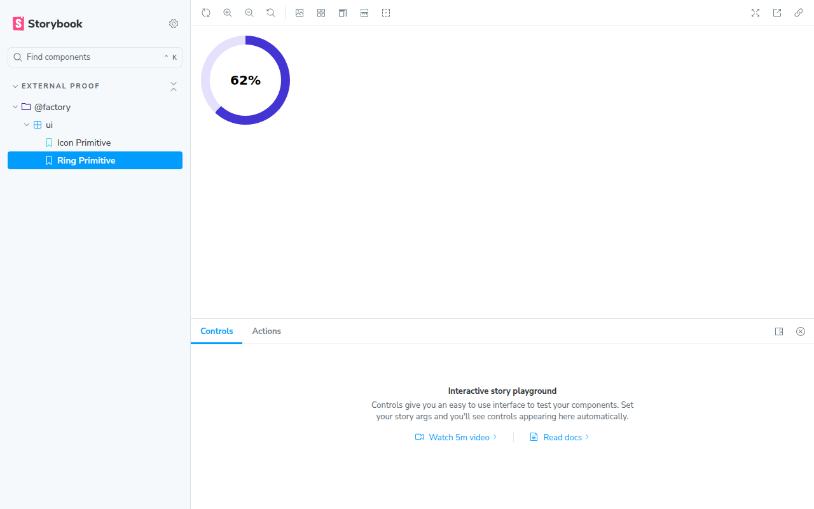

# factory-ui-external-storybook-proof

**FAC-1003 / FAC-998 AC2 proof.** This repo has no relationship to
`Alscd/nutrition-tracker` — separate git history, separate `package.json`,
separate install root, own Storybook config. It exists only to prove that
`@factory/ui` (extracted in nutrition-tracker PR #164, packaged in PR #165)
is consumable from *outside* that monorepo, per FAC-998's acceptance
criterion 2.

This branch lives inside `Alscd/factory-probe` (a throwaway scratch repo)
rather than a dedicated new repo: the write token used for this work
(`FACTORY_GIT_WRITE_TOKEN`) got a 403 (`Resource not accessible by personal
access token`) on `POST /user/repos` — repo creation needs broader
account-level scope than this fine-grained PAT has. Flagged as a follow-up
alongside the `packages:write` gap in nutrition-tracker's `packages/ui/README.md`.
`factory-probe`'s `main` branch is untouched.

## What this proves

- `@factory/ui@0.1.0` installs as a plain npm dependency (`file:./vendor/factory-ui-0.1.0.tgz`,
  fetched from the private GitHub Release attached to FAC-1003 — see
  `scripts/fetch-factory-ui.sh`) with **no pnpm workspace, no monorepo
  tooling, no `catalog:` protocol** in sight.
- `import { Icon, Ring } from '@factory/ui'` resolves and type-checks against
  the package's own shipped `.d.ts` (not source .tsx).
- A Storybook (`storybook@8.6.18`, same version pinned in nutrition-tracker)
  built entirely in this repo renders both primitives.

## What it doesn't prove (flagged, not fixed, here — see nutrition-tracker's `packages/ui/README.md`)

- `@factory/ui` ships structure only, not its CSS (`.icon`/`.ring` classes
  still live in the app). `src/demo.css` here is a small hand-reproduced
  subset so the story renders at a legible size — it is **not** part of the
  package and is called out as such in that file.
- The registry publish path (`npm.pkg.github.com`, scope `@factory`) is
  wired but not live (token scope gap) — this proof installs from a Release
  tarball instead, which is the documented interim distribution mechanism.

## Screenshots (built + rendered in this repo, FAC-1003)




## Running it yourself

```sh
FACTORY_GIT_READ_TOKEN=... npm run fetch-ui   # pulls vendor/factory-ui-0.1.0.tgz
npm install
npm run build-storybook                       # -> storybook-static/
```
